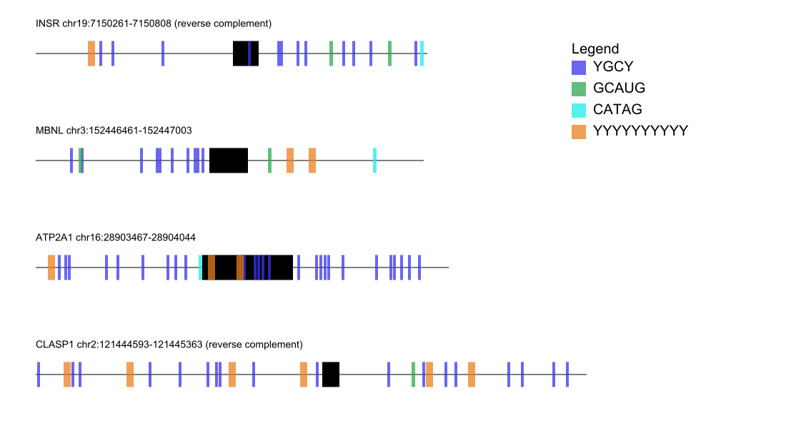

# motif-mark-oop
motif_mark_oop.py script visualizes motifs on gene segments input from a fasta file. Contains classes for the Fasta header, exon, motifs, and general gene group.

## Summary
Before being translated into proteins, mRNA undergoes the process of splicing to remove introns and paste together exons. Often mRNA can be alternatively spliced producing isoforms that may be specific to a certain cell type or function. Alternative splicing may be mediated by the presence of certain motifs or short sequences where proteins that regulate splicing bind or localize. The purpose of this script is to quickly visualize gene segments and the location of motifs.

## Input
 - fasta file containing genes where introns are lowercase and exons are uppercase
 - txt file containing motifs one per line, IUPAC ambigious encoding supported, case agnostic

## Output
 - SVG file named with prefix of fasta file
 - introns represented by thin black lines
 - exons are black rectangles
 - motifs are colored and denoted by legend
 
 
 
 
